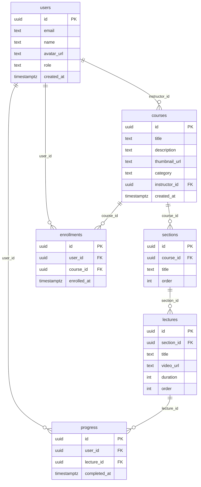

# ER図

```mermaid
erDiagram
    users {
        uuid id PK
        text email
        text name
        text avatar_url
        text role
        timestamptz created_at
    }

    courses {
        uuid id PK
        text title
        text description
        text thumbnail_url
        text category
        uuid instructor_id FK
        timestamptz created_at
    }

    sections {
        uuid id PK
        uuid course_id FK
        text title
        int order
    }

    lectures {
        uuid id PK
        uuid section_id FK
        text title
        text video_url
        int duration
        int order
    }

    enrollments {
        uuid id PK
        uuid user_id FK
        uuid course_id FK
        timestamptz enrolled_at
    }

    progress {
        uuid id PK
        uuid user_id FK
        uuid lecture_id FK
        timestamptz completed_at
    }

    users ||--o{ courses : "instructor_id"
    users ||--o{ enrollments : "user_id"
    users ||--o{ progress : "user_id"
    courses ||--o{ sections : "course_id"
    courses ||--o{ enrollments : "course_id"
    sections ||--o{ lectures : "section_id"
    lectures ||--o{ progress : "lecture_id"
```
